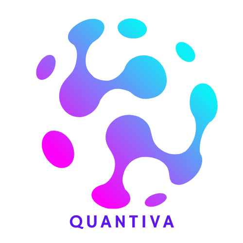

# Quantiva - AI-Powered Market Intelligence Platform

<div align="center">
  
  
  ### Transform Your Business Strategy with Automated Market Insights
  
  [](https://nextjs.org/)
  [](https://www.typescriptlang.org/)
  [](https://tailwindcss.com/)
  [](https://supabase.com/)
</div>

---

## 🚀 About Quantiva

Quantiva is a modern SaaS platform that provides automated market research and competitive intelligence powered by AI. Get data-backed insights delivered on your schedule, helping businesses make smarter strategic decisions.

## Tech Stack

- **Framework**: Next.js 16 (App Router)
- **Language**: TypeScript
- **Styling**: Tailwind CSS v4
- **UI Components**: Shadcn/UI (Button, Card, Input, Label, Checkbox, Avatar, Badge, Separator, Select, Radio Group, Textarea, Tabs)
- **Icons**: Lucide React
- **Navigation**: Next.js App Router with usePathname and useRouter hooks
- **Forms**: React state management with controlled components

## Project Structure

```
market_research/
├── app/
│   ├── dashboard/
│   │   ├── new-research/
│   │   │   └── page.tsx      # New research form (full)
│   │   ├── reports/
│   │   │   ├── [id]/
│   │   │   │   └── page.tsx  # Report detail (dynamic)
│   │   │   └── page.tsx      # Reports list
│   │   ├── schedules/
│   │   │   └── page.tsx      # Schedules page (placeholder)
│   │   ├── settings/
│   │   │   └── page.tsx      # Settings page (placeholder)
│   │   ├── layout.tsx        # Dashboard layout (sidebar + topbar)
│   │   └── page.tsx          # Dashboard home page
│   ├── login/
│   │   └── page.tsx          # Login page
│   ├── signup/
│   │   └── page.tsx          # Sign up page
│   ├── globals.css           # Global styles and Tailwind config
│   ├── layout.tsx            # Root layout
│   └── page.tsx              # Home page (landing page)
├── components/
│   └── ui/                   # Shadcn/UI components
│       ├── avatar.tsx
│       ├── badge.tsx
│       ├── button.tsx
│       ├── card.tsx
│       ├── checkbox.tsx
│       ├── input.tsx
│       ├── label.tsx
│       ├── radio-group.tsx
│       ├── select.tsx
│       ├── separator.tsx
│       ├── tabs.tsx
│       └── textarea.tsx
├── lib/
│   └── utils.ts              # Utility functions
└── public/                   # Static assets
```

## Features

### Home Page (/)

The landing page includes:

1. **Header/Navigation**
   - Logo: "Quantiva" with brand icon
   - Navigation links: Home, Features, How It Works
   - Login and Sign Up buttons

2. **Hero Section**
   - Main headline: "Automated Market Research and Competitive Intelligence"
   - Value proposition subtext
   - Primary CTA: "Get Started" → `/signup`
   - Secondary CTA: "Login" → `/login`

3. **Services/Value Proposition**
   - Three feature cards:
     - Automated Market Research
     - Competitive Intelligence
     - Recurring Market Monitoring
   - Each with icon, title, and description

4. **How It Works**
   - Step-by-step process:
     1. Select Market Category
     2. Run On-Demand or Scheduled Research
     3. Receive Structured Insights
   - Visual numbered steps with icons

5. **Call to Action**
   - Compelling copy encouraging sign-up
   - "Create Free Account" button → `/signup`

6. **Footer**
   - Product name
   - Copyright notice

### Dashboard Layout (/dashboard)

Authenticated user interface with:

1. **Sidebar Navigation**
   - Logo: "Quantiva" with brand icon
   - Navigation items:
     - Dashboard
     - New Research
     - Reports
     - Schedules
     - Settings
   - User profile section (bottom)

2. **Top Bar**
   - Dynamic page title based on current route
   - User avatar and info
   - Logout button with redirect to login

3. **Dashboard Home**
   - Welcome message with user name
   - "Create New Market Research" button
   - Summary cards:
     - Total Reports (24)
     - Active Schedules (5)
     - Last Research Run (with date/time)
   - Quick Actions section
   - Getting Started guide

4. **New Research Page** (`/dashboard/new-research`)
   - Market category dropdown (12+ options)
   - Sub-niche text input
   - Geographic focus (optional)
   - Research type selector (On-demand vs Recurring)
   - Conditional frequency dropdown
   - Additional notes textarea
   - Form validation and submission
   - Informational cards about process

5. **Reports Pages**
   - **Reports List** (`/dashboard/reports`)
     - Summary statistics cards
     - List of 5 mock reports
     - Report metadata (category, date, geography)
     - View report buttons
     - Empty state handling
   
   - **Report Detail** (`/dashboard/reports/[id]`)
     - Comprehensive report header
     - Tabbed navigation (4 sections)
     - Market Overview with segmentation
     - Market Trends analysis
     - Competitive landscape
     - Strategic insights and recommendations
     - Export and share buttons (UI only)

6. **Placeholder Pages**
   - Schedules: `/dashboard/schedules`
   - Settings: `/dashboard/settings`

### Login Page (/login)

Polished authentication UI with:
- Professional card-centered layout
- Email input field (Shadcn Input)
- Password input field (Shadcn Input)
- Remember me checkbox (Shadcn Checkbox)
- Forgot password link
- Sign in button
- Divider with "Or" separator
- Link to sign up page
- Form submission handler (ready for backend integration)

### Sign Up Page (/signup)

Polished registration UI with:
- Professional card-centered layout
- Full name input field (Shadcn Input)
- Email input field (Shadcn Input)
- Company name input field - optional (Shadcn Input)
- Password input field (Shadcn Input)
- Confirm password input field (Shadcn Input)
- Terms of service checkbox (Shadcn Checkbox)
- Create account button
- Divider with "Or" separator
- Link to login page
- Form submission handler (ready for backend integration)

## Design Principles

- **Clean SaaS aesthetic**: Modern, professional design
- **Minimalist**: Focus on content and clarity
- **Business-focused**: Professional tone, not marketing-heavy
- **Desktop-first**: Optimized for desktop with responsive mobile support

## Getting Started

### Prerequisites

- Node.js 18+ 
- npm or yarn

### Installation

1. Install dependencies:
```bash
npm install
```

2. Run the development server:
```bash
npm run dev
```

3. Open [http://localhost:3000](http://localhost:3000) in your browser

### Build for Production

```bash
npm run build
npm run start
```

## Navigation

### Public Pages
- Home page: `/`
- Login page: `/login`
- Sign up page: `/signup`

### Authenticated Pages (Dashboard)
- Dashboard Home: `/dashboard`
- New Research: `/dashboard/new-research` (Full form)
- Reports List: `/dashboard/reports` (5 mock reports)
- Report Detail: `/dashboard/reports/[id]` (Dynamic route)
- Schedules: `/dashboard/schedules` (Placeholder)
- Settings: `/dashboard/settings` (Placeholder)

All navigation uses Next.js App Router with proper routing and active states.

## Phase Development

### Phase 1 ✅
- Landing page with all sections
- Basic routing structure
- Initial UI shells for auth pages

### Phase 2 ✅
- Polished authentication UI with Shadcn components
- Professional form layouts
- Form submission handlers (ready for backend)
- Enhanced user experience with proper spacing and styling

### Phase 3 ✅
- Dashboard layout with sidebar navigation
- Top bar with user info and logout
- Dashboard home page with summary cards
- Placeholder pages for all dashboard routes
- Mock data implementation
- Complete authenticated user experience

### Phase 4 ✅
- New Research form with full configuration options
- Market category dropdown with 12+ categories
- Research type selection (on-demand vs recurring)
- Conditional frequency selector for recurring research
- Reports list page with mock data (5 reports)
- Individual report detail pages with tabbed sections
- Comprehensive report content (Overview, Trends, Competitors, Insights)
- Professional form validation and user feedback

## Notes

- No backend integration yet (Phase 5 will add API)
- All forms have submission handlers ready for backend logic
- Login and Sign Up redirect to dashboard on submit
- Logout button redirects to login page
- Mock data used throughout the application
- New Research form logs data to console on submit
- Reports use static mock data (5 sample reports)
- Form validation is client-side only
- All placeholder content is professional and production-ready
- Components are structured for easy backend integration
- Dashboard layout is reusable across all authenticated pages
- Dynamic routing implemented for report detail pages

## Color Scheme

The design uses a neutral color palette with blue accents:
- Primary: Blue (#2563eb)
- Background: White/Gray
- Text: Gray-900/Gray-600
- Accents: Purple, Green (for feature cards)

## Future Enhancements

- Backend API integration
- User authentication
- Dashboard implementation
- Market research tools
- Analytics and reporting features
